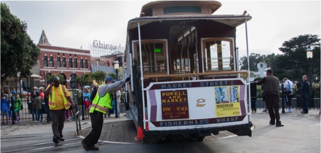

## ANALYZING-SAN-FRANCISCO-PAYROLL-DATA
Analyzed the City of San Francisco (California, USA) payroll data from 2011-2015. Identified potential overtime abuse in 2015 and habitual abuse from 2011-2015.

</IMG>

##FINAL PRESENTATION
See my <A HREF="Analyzing_SF_Payroll_Data_BFauber.pdf" target="_blank">final presentation deck</A> in PDF.

##PYTHON and R CODES
Check out the python code for <A HREF="DataCleaning.py" target="_blank">data cleaning</A> and <A HREF="WordCount_JobTitles.py" target="_blank">identifying the job title keywords</A>, as well as the <A HREF="Analyzing_Pay.Rdata" target="_blank">R code</A> for this project.

## PROJECT SUMMARY
The payroll data for City of San Francisco, California (USA) employees from 2011-2015 is available from the <A HREF="https://npri.org/" target="_blank">Nevada Policy Research Institute</A>.  The 188,037 x 11 (2.1 million data points) data set was organized and cleaned primarily with Python.  The cleaned data was analyzed using Python and R, relying on the strengths of each language for a rich result.

There were 39,387 total City of San Francisco (SF) employees in 2015.  The number of employees increased 9% from 2011-2015, while total base pay increased 18% and total OT pay increased 35% in the same period.

The job titles of all 2015 employees were analyzed for the most common keywords.  The top 20 keywords were identified and the payroll data associated with the top 10 were further profiled.  Fire, Police, and Engineering jobs collected over 30% more base pay than the average SF employee in 2015.  Fire jobs collected the highest average base pay, 57% more than the average SF employee in 2015.  Fire was the highest paid group by all metrics (mean, median, first and third quartile).

Fire, Transit, Operator (closely-associated with Transit keyword), Sheriff, and Police jobs collected significantly more % OT pay (calculated as a percentage of base pay) than other jobs.  The average employee in 2015 collected 7.1% of their base pay in OT pay, but that mean value was skewed by the above job types as the median % OT pay in 2015 was 0%.

Further investigation of the data indicated substantial abuse of OT in Fire, Sheriff, Transit, and Police jobs.  In 2015, 37 employees were paid more in OT than in base pay; 34 of those employees were in Fire, Sheriff, Transit, or Police jobs.

Recommend implementing additional safeguards to prevent OT abuse in these departments.  Also increase scrutiny of employees with a history of OT abuse (collecting >8% of base pay in OT pay), especially those with year-over-year abuses.  It is unlikely that the OT abuse in Fire, Sheriff, Transit, and Police jobs is due to staffing shortages as there are other hourly essential jobs without this absurd use of OT (e.g. Nurse jobs).
